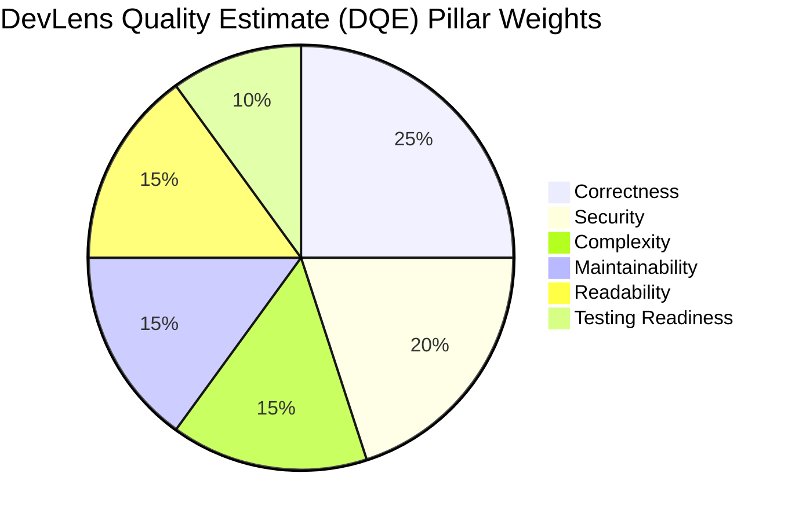

# Product Requirements Document (PRD)

## Project Title: DevLens — Production-Grade Code Intelligence, Debugging & Learning Platform
**Document Version:** 1.0.0  
**Classification:** Core Product Specification  
**Status:** Approved for Architecture & Implementation  
**Target Path:** `docs/PRD.md`  
**Primary Stakeholders:** Engineering Leads, System Architects, Security Engineers, QA Engineers, Frontend/Backend Developers, CSE-AIML Academic Evaluators  

---

### Executive Table of Contents
1. [Executive Summary & Vision](#1-executive-summary--vision)
2. [Target Audience & User Personas](#2-target-audience--user-personas)
3. [Core Philosophy, Guiding Principles & Non-Negotiable Guardrails](#3-core-philosophy-guiding-principles--non-negotiable-guardrails)
4. [DevLens Quality Estimate (DQE) Scoring Methodology](#4-devlens-quality-estimate-dqe-scoring-methodology)
5. [Dual-Analysis Pipeline Architecture (Deterministic Static + Model-Assisted Synthesis)](#5-dual-analysis-pipeline-architecture)
6. [Core Feature Specifications & INVEST User Stories](#6-core-feature-specifications--invest-user-stories)
   - 6.1 Authentication & Identity Lifecycle Management
   - 6.2 Code Ingestion & Multi-Language Support
   - 6.3 Dual Analysis Engine & Categorized Diagnostics
   - 6.4 Algorithmic Complexity Profiler (Time & Space Big-O)
   - 6.5 Security Vulnerability Detection & CWE Mapping
   - 6.6 Refactoring Engine & Unified Code Diffs
   - 6.7 Framework-Specific Unit Test Synthesis
   - 6.8 Analytics Dashboard, History & Safe Data Export
   - 6.9 Privacy, Data Governance & LLM Payload Transparency
7. [Non-Functional Requirements (NFRs)](#7-non-functional-requirements-nfrs)
8. [Scope Boundaries: V1 (MVP) vs. Future Roadmap](#8-scope-boundaries-v1-mvp-vs-future-roadmap)
9. [Explicit Out-of-Scope Boundaries (Non-Goals)](#9-explicit-out-of-scope-boundaries-non-goals)
10. [Edge Cases, Failure Modes & Graceful Degradation](#10-edge-cases-failure-modes--graceful-degradation)
11. [Success Metrics & Key Performance Indicators (KPIs)](#11-success-metrics--key-performance-indicators-kpis)
12. [Appendix & Quality Pillar Matrix](#12-appendix--quality-pillar-matrix)

---

## 1. Executive Summary & Vision

### 1.1 The Problem
Modern software development tools generally fall into two polar extremes:
1. **Opaque Static Analyzers & Linters:** Tools such as ESLint, Flake8, or Clang-Tidy identify syntax issues and rule violations with extreme precision, but produce cryptic error codes and minimal pedagogical explanation. They tell developers *what* is wrong without explaining *why* or illustrating how to fix it within real-world context.
2. **Generative Chatbots:** Generic large language models generate fluent suggestions, but frequently hallucinate invalid APIs, invent speculative syntax, miss subtle algorithmic bottlenecks, and produce unvetted code without deterministic safeguards. Furthermore, commercial tools often treat quality assessment as an arbitrary black box.

### 1.2 The DevLens Solution
**DevLens** is a transparent, educational, developer-grade code analysis and debugging platform designed specifically for students, software engineers, and technical interview candidates. DevLens bridges the gap between mechanical static analysis and generative AI by implementing a **Dual-Analysis Pipeline**:
- **Deterministic Static Foundations:** High-speed AST parsing, compiler diagnostics, cyclomatic complexity calculations, and known pattern matching provide verifiable truth.
- **Model-Assisted Synthesis:** Generative language models contextualize findings, explain underlying computer science principles, formulate idiomatic refactoring diffs, and synthesize framework-aligned unit tests.
- **Transparent Developer-in-the-Loop Architecture:** All quality metrics, security mappings, and suggested improvements are fully documented, advisory, and accompanied by explicit human-verification disclaimers. DevLens never executes arbitrary user code on its primary servers, ensuring a secure, sandboxed, and resilient environment.

### 1.3 Strategic Purpose
DevLens serves as a flagship engineering portfolio artifact for a CSE-AIML graduate. It demonstrates mastery across full-stack systems engineering, compiler/AST fundamentals, API security, distributed LLM orchestration, and ethical, transparent AI design.

---

## 2. Target Audience & User Personas

### 2.1 Persona Matrix

| Persona | Role & Profile | Primary Goals | Key Pain Points |
| :--- | :--- | :--- | :--- |
| **P1: The CS/AIML Student** | Computer Science or AI/Data Science student learning data structures, memory management, and clean code. | Understand compiler errors in C/C++/Python; learn algorithmic complexity (Big-O); understand why a pointer dereference or recursion depth fails. | Generic compiler error messages are confusing; course TAs are unavailable; ChatGPT gives answers without explaining foundational mechanics. |
| **P2: The Technical Interviewee** | Active candidate preparing for algorithmic coding rounds and system design screens. | Rapidly verify time and space complexity of LeetCode/HackerRank solutions; identify unhandled boundary cases; practice writing unit tests. | Difficulty calculating exact amortized space/time complexity; missing edge cases (e.g., integer overflow, empty collections, recursion limits). |
| **P3: The Junior/Mid-Level Engineer** | Early-career software engineer working in a modern engineering organization. | Verify code quality and security standards before submitting pull requests; learn idiomatic design patterns in unfamiliar languages (e.g., moving between Python and TypeScript). | Fear of leaking API credentials or introducing SQLi/XSS vulnerabilities; linters are rigid and do not provide automated unified diffs. |
| **P4: The Self-Taught Developer** | Bootcamp or self-directed learner building software without traditional formal CS fundamentals. | Bridge theoretical gaps in algorithm optimization, architectural maintainability, and enterprise testing standards. | Inconsistent understanding of testing frameworks (pytest, Jest, JUnit) and vulnerability classifications (CWE). |

---

## 3. Core Philosophy, Guiding Principles & Non-Negotiable Guardrails

To maintain uncompromising scientific honesty, engineering integrity, and legal/ethical defensibility, DevLens operates under four non-negotiable architectural mandates:

### 3.1 Non-Negotiable Security Mandate
> **Zero Impossible Claims:** Under no circumstances shall DevLens marketing, user interface, documentation, or metadata claim that the product is "100% secure", "unhackable", "bulletproof", or guarantees "zero vulnerabilities". 
> **Standardized Formulation:** DevLens security posture must strictly and universally be stated as:  
> *"Designed with security best practices and continuously tested for common vulnerabilities."*

### 3.2 Human-in-the-Loop Transparency Disclaimer
> **Advisory Nature of Machine Learning:** AI-generated recommendations, refactoring diffs, and synthetic tests are advisory hypotheses. DevLens displays a persistent, prominent disclaimer on all diagnostic views:  
> *"AI suggestions and generated tests are recommendations intended for educational and acceleration purposes. All suggestions must be verified by the developer before execution or deployment."*

### 3.3 Balanced Terminology Protocol
DevLens must **not** be ubiquitously labeled as an "AI-powered tool". AI is an integrated downstream synthesis component that operates in strict partnership with deterministic static analysis. Technical communications must describe the platform as:  
*"A hybrid code intelligence platform combining deterministic static analysis with model-assisted educational synthesis."*

### 3.4 Strict Execution Sandbox Guardrail
To eliminate remote code execution (RCE) vectors, **DevLens strictly forbids direct, arbitrary user code execution on the primary server infrastructure in v1**. Static parsing, AST tokenization, regex matching, and LLM prompt serialization are the only server-side operations permitted. Any future interactive execution capabilities must reside within dedicated, ephemeral microVMs (e.g., AWS Firecracker or WebAssembly runtimes) completely isolated from core platform state.

---

## 4. DevLens Quality Estimate (DQE) Scoring Methodology

Rather than generating an opaque, uncalibrated score, DevLens introduces the **DevLens Quality Estimate (DQE)**: a transparent, deterministic-weighted advisory score ranging from **0 to 100**.

### 4.1 Six Evaluation Pillars & Weight Distribution

1. **Correctness (25% Weight):**
   - Syntax validity and AST parse success across the target language grammar.
   - Absence of unhandled null/undefined dereferences, uninitialized variables, unreachable code paths, or type mismatches identified via static analysis.
2. **Security (20% Weight):**
   - Absence of high-risk patterns mapped to common CWEs (e.g., CWE-89 SQL Injection, CWE-79 Cross-Site Scripting, CWE-120 Buffer Copy without Checking Size of Input, CWE-798 Hardcoded Credentials).
   - Sanitization and validation rigor around user inputs and external I/O.
3. **Complexity (15% Weight):**
   - Cyclomatic Complexity: Penalties applied when function cyclomatic complexity exceeds 10.
   - Nesting Depth: Penalties applied for loop/conditional nesting exceeding 3 levels.
   - Algorithmic scaling characteristics (e.g., unnecessary nested loops yielding O(N^2) where O(N log N) or O(N) is achievable).
4. **Maintainability (15% Weight):**
   - Modularity and single-responsibility compliance (function line lengths exceeding 50 lines incur deductions).
   - DRY (Don't Repeat Yourself) score: Repetitive AST subtree structures and copy-paste blocks.
   - Constant parameterization vs. hardcoded "magic numbers".
5. **Readability (15% Weight):**
   - Naming conventions conforming to target language idioms (e.g., `snake_case` in Python, `camelCase` in JS/TS/Java).
   - Effective comment-to-code ratio and documentation clarity for non-trivial logic.
   - Consistent formatting and cognitive complexity metrics.
6. **Testing Readiness (10% Weight):**
   - Function purity and testability (ratio of pure functions vs. tightly coupled external state/I/O).
   - Dependency injection readiness and ease of mocking inputs/outputs.

### 4.2 Mathematical Scoring Formulation

For each pillar $i \in \{1 \dots 6\}$, an initial raw sub-score $S_i = 100$ is established. Deductions are calculated based on detected issues weighted by severity:

$$S_i = \max\left(0, 100 - \sum_{k} \text{Deduction}(Issue_{i,k})\right)$$

Where deductions per issue severity are strictly bounded:
- **Critical Severity:** $-15$ points
- **High Severity:** $-10$ points
- **Medium Severity:** $-5$ points
- **Low Severity:** $-2$ points
- **Informational / Style:** $0$ points (advisory only)

The final aggregate DQE is calculated as the weighted linear sum:

$$\text{DQE} = \sum_{i=1}^{6} (w_i \times S_i) \quad \text{where } \sum w_i = 1.00$$

### 4.3 Advisory Grade Bands
- **90 – 100:** Production Ready / Exemplary (Minimal minor stylistic recommendations)
- **75 – 89:** Good / Minor Remediation Recommended (Low or medium maintainability/readability issues)
- **60 – 74:** Needs Improvement (High-complexity bottlenecks or medium security concerns)
- **Below 60:** Critical Attention Required (Syntax anomalies, high-severity CWE patterns, or extreme cyclomatic complexity)

---

## 5. Dual-Analysis Pipeline Architecture

### 5.1 Strict Classification Hierarchy
To guarantee transparency, every finding presented to the user must carry one of four unambiguous visual badges:
1. `[DETERMINISTIC STATIC FINDING]`: Sourced directly from verifiable compiler parsing, AST traversal, or regex patterns. 100% reproducible without non-deterministic drift.
2. `[AI SUGGESTION]`: Sourced from the language model synthesis. Contextual, educational, and refactoring-oriented.
3. `[POSSIBLE ISSUE]`: Identified through heuristic analysis or probabilistic model reasoning. Requires developer validation.
4. `[INFORMATIONAL]`: Educational remarks, design pattern observations, or language idiom notes.

---

## 6. Core Feature Specifications & User Stories

### 6.1 Authentication & Identity Lifecycle Management
- Secure user registration with email, password validation (min 8 chars, mixed case, digit, special character).
- Passwords hashed using standard strong hashing (Argon2id / Bcrypt).
- JWT token authentication with short-lived access tokens and secure refresh tokens.
- Password reset request workflow.
- Account deletion (right to be forgotten) with cascading purge of all user analyses, findings, and metrics.

### 6.2 Code Ingestion & Multi-Language Support
- Ingestion of single-file snippets up to 500 lines / 10,000 characters.
- Initial supported languages: C, C++, Python, Java, JavaScript, TypeScript.
- Extensible language analyzer registry architecture.

### 6.3 Dual Analysis Engine & Categorized Diagnostics
- Parallel or sequenced execution: Deterministic static analysis executes first, generating verified AST metrics, syntax checks, and rule violations.
- Downstream AI synthesis receives sanitized structured context and returns strict JSON output.
- Result aggregator merges static and AI findings, deduplicates, and calculates DQE score.
- Full graceful degradation: if AI provider is unavailable, static findings and scores are returned seamlessly.

### 6.4 Algorithmic Complexity Profiler
- Estimation of Big-O Time Complexity (e.g. O(1), O(log n), O(n), O(n log n), O(n^2), O(2^n)).
- Estimation of Big-O Space Complexity (Auxiliary memory, recursion stack depth).
- Deterministic loop depth and recursion detection combined with model explanations.

### 6.5 Security Vulnerability Detection & CWE Mapping
- Detection of dangerous patterns (SQL injection, XSS, buffer overflows, format string vulnerabilities, command execution, hardcoded credentials).
- Exact CWE mapping (CWE-89, CWE-79, CWE-120, CWE-798, etc.).
- Concrete remediation suggestions with safe code alternatives.

### 6.6 Refactoring Engine & Unified Code Diffs
- Generation of clean refactored alternatives.
- Visual side-by-side or inline unified diff showing exact line additions (+) and deletions (-).
- Concise educational rationales for each modification.

### 6.7 Framework-Specific Unit Test Synthesis
- Language-specific test generation:
  - Python -> `pytest`
  - JavaScript / TypeScript -> `Jest` / `Vitest`
  - Java -> `JUnit 5`
  - C++ -> `GoogleTest` / `Catch2`
  - C -> `Unity` / Standard Assertions
- Comprehensive coverage including happy path, boundary conditions, and exception testing.

### 6.8 Analytics Dashboard, History & Safe Data Export
- User dashboard showing lifetime analysis count, average DQE score, language breakdown, and quality trends.
- Safe export of reports to JSON (machine-readable) and Markdown (PR/submission ready).
- User deletion of individual analysis records or entire history.

### 6.9 Privacy, Data Governance & LLM Payload Transparency
- Ephemeral analysis mode: guest users or users with auto-save disabled do not persist code in database.
- Complete transparency: explicit disclosure of third-party model transmission and zero persistent code storage unless explicitly saved.

---

## 7. Scope Boundaries: V1 (MVP) vs. Future Roadmap
- **V1 Flagship Scope:** Single-file analysis ($\le 500$ lines), 6 core languages, dual static+AI pipeline, DQE scoring, Big-O complexity, CWE mapping, unified diffs, unit test synthesis, JWT auth, dashboard, export.
- **Future Roadmap:** Multi-file repositories, GitHub PR integration, sandboxed WebAssembly execution of unit tests, IDE extensions.

---

## 8. Explicit Out-of-Scope (Non-Goals)
1. **Direct arbitrary server-side code execution:** DevLens will NEVER execute unvetted user code directly on the host application server.
2. Full multi-gigabyte monorepo indexing.
3. Automated continuous deployment or PR auto-merging.
