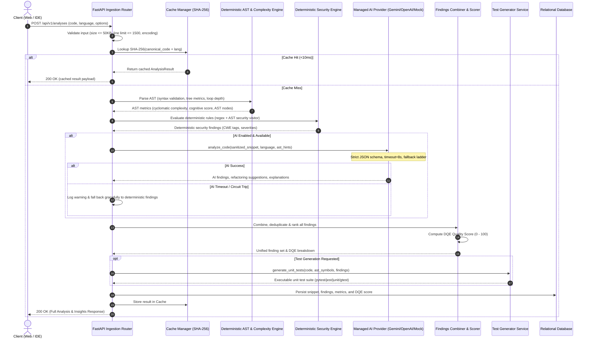

# DevLens Comprehensive System Architecture Specification

**Document Path**: `docs/architecture.md`  
**Version**: 1.0.0 (Production Blueprint)  
**Status**: APPROVED  
**Target Platform**: DevLens — Production-Grade Code Intelligence, Debugging & Learning Platform

---

# 1. Executive Summary & Architectural Vision

DevLens is an enterprise-ready, developer-centric code intelligence platform designed to ingest source code across multiple languages, execute comprehensive deterministic static/security analysis, extract structural complexity metrics, orchestrate structured AI analysis, compute a standardized DevLens Quality Estimate (DQE), and generate verifiable unit tests.

### Core Architectural Tenets
1. **Deterministic-First Foundation**: Critical security vulnerabilities, syntactic bugs, and computational complexities are first analyzed using deterministic AST visitors and static rulesets. The AI layer acts as an educational and contextual augment, not an ungrounded oracle.
2. **Zero Host Execution (Absolute Isolation)**: User code is untrusted. User code is **never compiled or executed directly** on the application host.
3. **Pluggable Multi-Provider AI Core**: Decoupled from any single proprietary LLM provider via an abstract provider adapter interface (`AIProvider`), featuring a deterministic offline mock provider for 100% test hermeticity, plus native adapters for Google Gemini, OpenAI, and local Ollama models.
4. **Graceful Degradation Under Load/Fault**: If external AI providers experience outages, rate-limits, or timeouts, DevLens seamlessly degrades to deterministic static analysis mode, guaranteeing uninterrupted developer workflows with zero 500 errors.
5. **Content-Addressable Deduplication & Caching**: Code snippets are hashed (SHA-256) alongside configuration parameters to provide sub-10ms cache hits for identical code analyses.

---

# 2. High-Level Architectural Pattern: Clean Architecture & Modular Monolith

DevLens is architected as a **Modular Monolith** employing **Clean Architecture** (Ports and Adapters).
- **Frontend**: Modern SPA built with React 19, TypeScript, Vite, TailwindCSS, Lucide-react.
- **Backend**: Asynchronous, high-throughput ASGI core built with Python 3.11+, FastAPI, and Pydantic v2.

Within the backend:
- **Presentation Layer (`api/`)**: FastAPI Routers, HTTP request/response schemas, middlewares.
- **Application / Service Layer (`services/`)**: Orchestration of analysis pipelines, scoring computations, test generation coordination.
- **Analyzers Layer (`analyzers/`)**: Deterministic AST parsers, regex analyzers, static rule evaluators.
- **AI Layer (`ai/`)**: Pluggable provider abstraction (`AIProvider`, `GeminiProvider`, `MockProvider`, `OpenAIProvider`).
- **Data Layer (`models/`, `database/`)**: SQLAlchemy 2.0 ORM models, session management, repository patterns.
- **Security & Logging Layer (`security/`, `logging/`)**: Rate limiting, sanitization, audit logging, structured logging.

---

# 3. Code Analysis Pipeline Flow

---

# 4. Zero-Host-Execution Guarantee

1. **Static Analysis Only**: No user code is ever executed with `exec`, `eval`, or dynamic compilation on the host machine.
2. **Resource-Bounded Parsing**:
   - Python uses the built-in compiler `compile()` to parse source without executing it.
   - JavaScript uses Node.js `--check`; TypeScript uses `tsc --noEmit`; C/C++ use GCC/G++ with `-fsyntax-only`; Java uses `javac` with annotation processing disabled. These checks report compiler errors and available warnings without running the submitted program.
   - Compiler subprocesses have a short timeout, run in temporary working directories, and do not run generated binaries. If a compiler is unavailable, the UI must label results as incomplete rather than suggesting that the program is error-free.
   - GitHub Pages/browser-only fallback checks are intentionally limited and display a compiler-unavailable notice; full diagnostics require the Docker Compose backend and its language toolchains.
3. **Future Sandboxed MicroVM Architecture (v2)**:
   - Any future dynamic execution (e.g. running generated tests) must run in isolated gVisor/Firecracker microVMs with `--net=none`, read-only filesystems, and strict CPU/RAM limits.
