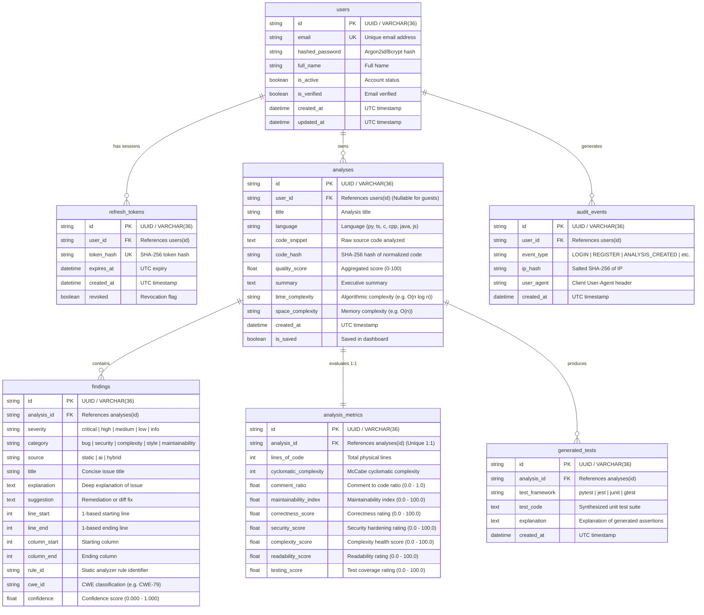

# DevLens Database Architecture & Data Model Specification

## 1. Overview & Architectural Principles

DevLens is an AI-assisted code analysis and intelligence platform. The database architecture is designed with the following foundational principles:
- **Dual-Database Support**: Seamless operation across **PostgreSQL 15+** (production enterprise grade) and **SQLite 3.35+** (local zero-dependency development and test suites).
- **Strict Data Integrity**: Strong relational typing, explicit foreign keys, check constraints, and non-nullable defaults.
- **GDPR & Privacy by Design**: Zero orphaned data via strict cascading deletions (`ON DELETE CASCADE`) rooted at the `users` and `analyses` tables. Pseudonymized IP addresses for audit logs.
- **Deduplication & Cache Acceleration**: Code snippets are hashed using SHA-256 (`code_hash`), allowing indexed deduplication and sub-millisecond retrieval of previously analyzed code segments.
- **High Concurrency & Low Latency**: Targeted composite indexes aligned with dashboard query patterns (`user_id, created_at DESC`), severity filtering (`analysis_id, severity`), and session validations.

---

## 2. Entity-Relationship Diagram (ERD)



---

## 3. Data Dictionary & Detailed Specifications

### 3.1. `users` Table
Stores authenticated user accounts.

| Column | Type (PG) | Type (SQLite) | Constraints | Description |
| :--- | :--- | :--- | :--- | :--- |
| `id` | `VARCHAR(36)` | `TEXT` | `PRIMARY KEY` | Standard RFC 4122 UUID v4 |
| `email` | `VARCHAR(255)` | `TEXT` | `NOT NULL, UNIQUE` | Normalized lower-case email |
| `hashed_password` | `VARCHAR(255)` | `TEXT` | `NOT NULL` | Argon2id or Bcrypt hashed password |
| `full_name` | `VARCHAR(150)` | `TEXT` | `NOT NULL` | Display name of the user |
| `is_active` | `BOOLEAN` | `INTEGER` | `NOT NULL DEFAULT TRUE` | Active/suspended toggle |
| `is_verified` | `BOOLEAN` | `INTEGER` | `NOT NULL DEFAULT FALSE` | Email confirmation status |
| `created_at` | `TIMESTAMPTZ` | `TEXT` | `NOT NULL DEFAULT CURRENT_TIMESTAMP` | Account creation timestamp (UTC) |
| `updated_at` | `TIMESTAMPTZ` | `TEXT` | `NOT NULL DEFAULT CURRENT_TIMESTAMP` | Last profile update timestamp |

### 3.2. `refresh_tokens` / `sessions` Table
Manages user refresh tokens, session longevity, and explicit revocation.

| Column | Type (PG) | Type (SQLite) | Constraints | Description |
| :--- | :--- | :--- | :--- | :--- |
| `id` | `VARCHAR(36)` | `TEXT` | `PRIMARY KEY` | UUID v4 |
| `user_id` | `VARCHAR(36)` | `TEXT` | `NOT NULL, FK -> users(id) ON DELETE CASCADE` | Token owner |
| `token_hash` | `VARCHAR(64)` | `TEXT` | `NOT NULL, UNIQUE` | SHA-256 hash of issued refresh token |
| `expires_at` | `TIMESTAMPTZ` | `TEXT` | `NOT NULL` | Absolute token expiration time |
| `created_at` | `TIMESTAMPTZ` | `TEXT` | `NOT NULL DEFAULT CURRENT_TIMESTAMP` | Token generation time |
| `revoked` | `BOOLEAN` | `INTEGER` | `NOT NULL DEFAULT FALSE` | Revocation indicator |

### 3.3. `analyses` Table
Core entity tracking code scans, scores, and metadata.

| Column | Type (PG) | Type (SQLite) | Constraints | Description |
| :--- | :--- | :--- | :--- | :--- |
| `id` | `VARCHAR(36)` | `TEXT` | `PRIMARY KEY` | UUID v4 |
| `user_id` | `VARCHAR(36)` | `TEXT` | `NULLABLE, FK -> users(id) ON DELETE CASCADE` | Owner (`NULL` for guest/quick scan) |
| `title` | `VARCHAR(255)` | `TEXT` | `NOT NULL DEFAULT 'Untitled Analysis'` | Human-readable title/function name |
| `language` | `VARCHAR(50)` | `TEXT` | `NOT NULL` | Language (`python`, `typescript`, etc.) |
| `code_snippet` | `TEXT` | `TEXT` | `NOT NULL` | Source code under review |
| `code_hash` | `VARCHAR(64)` | `TEXT` | `NOT NULL` | SHA-256 hash of normalized code |
| `quality_score` | `NUMERIC(5,2)` | `REAL` | `CHECK(quality_score BETWEEN 0.0 AND 100.0)` | Overall 0-100 quality score |
| `summary` | `TEXT` | `TEXT` | `NULLABLE` | Markdown executive summary |
| `time_complexity` | `VARCHAR(50)` | `TEXT` | `NULLABLE` | Big-O notation, e.g., `O(n log n)` |
| `space_complexity` | `VARCHAR(50)` | `TEXT` | `NULLABLE` | Big-O notation, e.g., `O(n)` |
| `created_at` | `TIMESTAMPTZ` | `TEXT` | `NOT NULL DEFAULT CURRENT_TIMESTAMP` | Submission timestamp (UTC) |
| `is_saved` | `BOOLEAN` | `INTEGER` | `NOT NULL DEFAULT TRUE` | Saved to user history |

### 3.4. `findings` Table
Granular security issues, bugs, and performance recommendations per analysis.

| Column | Type (PG) | Type (SQLite) | Constraints | Description |
| :--- | :--- | :--- | :--- | :--- |
| `id` | `VARCHAR(36)` | `TEXT` | `PRIMARY KEY` | UUID v4 |
| `analysis_id` | `VARCHAR(36)` | `TEXT` | `NOT NULL, FK -> analyses(id) ON DELETE CASCADE` | Associated analysis |
| `severity` | `VARCHAR(20)` | `TEXT` | `CHECK(severity IN ('critical','high','medium','low','info'))` | Issue urgency |
| `category` | `VARCHAR(30)` | `TEXT` | `CHECK(category IN ('bug','security','complexity','style','maintainability'))` | Domain category |
| `source` | `VARCHAR(20)` | `TEXT` | `CHECK(source IN ('static','ai','hybrid'))` | Detection engine |
| `title` | `VARCHAR(255)` | `TEXT` | `NOT NULL` | Headline of issue |
| `explanation` | `TEXT` | `TEXT` | `NOT NULL` | In-depth technical context |
| `suggestion` | `TEXT` | `TEXT` | `NULLABLE` | Code replacement or recommendation |
| `line_start` | `INTEGER` | `INTEGER` | `NOT NULL, CHECK(line_start >= 1)` | 1-based start line |
| `line_end` | `INTEGER` | `INTEGER` | `NOT NULL, CHECK(line_end >= line_start)` | 1-based end line |
| `column_start` | `INTEGER` | `INTEGER` | `NULLABLE, CHECK(column_start >= 1 OR column_start IS NULL)` | Start column |
| `column_end` | `INTEGER` | `INTEGER` | `NULLABLE, CHECK(column_end >= column_start OR column_end IS NULL)` | End column |
| `rule_id` | `VARCHAR(100)` | `TEXT` | `NULLABLE` | Analyzer rule identifier |
| `cwe_id` | `VARCHAR(50)` | `TEXT` | `NULLABLE` | e.g. `CWE-89`, `CWE-79` |
| `confidence` | `NUMERIC(4,3)` | `REAL` | `NOT NULL DEFAULT 1.0 CHECK(confidence BETWEEN 0.0 AND 1.0)` | Engine certainty |

### 3.5. `analysis_metrics` Table
Normalized numerical metrics (Strict 1:1 relationship with `analyses`).

| Column | Type (PG) | Type (SQLite) | Constraints | Description |
| :--- | :--- | :--- | :--- | :--- |
| `id` | `VARCHAR(36)` | `TEXT` | `PRIMARY KEY` | UUID v4 |
| `analysis_id` | `VARCHAR(36)` | `TEXT` | `NOT NULL, UNIQUE, FK -> analyses(id) ON DELETE CASCADE` | 1:1 foreign key |
| `lines_of_code` | `INTEGER` | `INTEGER` | `NOT NULL, CHECK(lines_of_code >= 0)` | Physical LOC |
| `cyclomatic_complexity` | `INTEGER` | `INTEGER` | `NOT NULL, CHECK(cyclomatic_complexity >= 1)` | Complexity value |
| `comment_ratio` | `NUMERIC(5,4)` | `REAL` | `NOT NULL DEFAULT 0.0 CHECK(comment_ratio BETWEEN 0.0 AND 1.0)` | Ratio of comments |
| `maintainability_index` | `NUMERIC(5,2)` | `REAL` | `NOT NULL CHECK(maintainability_index BETWEEN 0.0 AND 100.0)` | Maintainability (0-100) |
| `correctness_score` | `NUMERIC(5,2)` | `REAL` | `NOT NULL CHECK(correctness_score BETWEEN 0.0 AND 100.0)` | Correctness (0-100) |
| `security_score` | `NUMERIC(5,2)` | `REAL` | `NOT NULL CHECK(security_score BETWEEN 0.0 AND 100.0)` | Security (0-100) |
| `complexity_score` | `NUMERIC(5,2)` | `REAL` | `NOT NULL CHECK(complexity_score BETWEEN 0.0 AND 100.0)` | Complexity rating (0-100) |
| `readability_score` | `NUMERIC(5,2)` | `REAL` | `NOT NULL CHECK(readability_score BETWEEN 0.0 AND 100.0)` | Readability rating (0-100) |
| `testing_score` | `NUMERIC(5,2)` | `REAL` | `NOT NULL CHECK(testing_score BETWEEN 0.0 AND 100.0)` | Testability rating (0-100) |

### 3.6. `generated_tests` Table
Synthesized automated unit tests for analyzed code snippets.

| Column | Type (PG) | Type (SQLite) | Constraints | Description |
| :--- | :--- | :--- | :--- | :--- |
| `id` | `VARCHAR(36)` | `TEXT` | `PRIMARY KEY` | UUID v4 |
| `analysis_id` | `VARCHAR(36)` | `TEXT` | `NOT NULL, FK -> analyses(id) ON DELETE CASCADE` | Target analysis |
| `test_framework` | `VARCHAR(50)` | `TEXT` | `NOT NULL` | e.g. `pytest`, `jest`, `vitest` |
| `test_code` | `TEXT` | `TEXT` | `NOT NULL` | Executable test file text |
| `explanation` | `TEXT` | `TEXT` | `NULLABLE` | Rationale & edge cases covered |
| `created_at` | `TIMESTAMPTZ` | `TEXT` | `NOT NULL DEFAULT CURRENT_TIMESTAMP` | Generation timestamp (UTC) |

### 3.7. `audit_events` Table
Security, compliance, and user action tracking.

| Column | Type (PG) | Type (SQLite) | Constraints | Description |
| :--- | :--- | :--- | :--- | :--- |
| `id` | `VARCHAR(36)` | `TEXT` | `PRIMARY KEY` | UUID v4 |
| `user_id` | `VARCHAR(36)` | `TEXT` | `NOT NULL, FK -> users(id) ON DELETE CASCADE` | Actor |
| `event_type` | `VARCHAR(50)` | `TEXT` | `NOT NULL, CHECK(event_type IN ('LOGIN','REGISTER','ANALYSIS_CREATED','ANALYSIS_DELETED','ACCOUNT_DELETED','EXPORT'))` | Action type |
| `ip_hash` | `VARCHAR(64)` | `TEXT` | `NULLABLE` | Salted SHA-256 for privacy |
| `user_agent` | `VARCHAR(255)` | `TEXT` | `NULLABLE` | Client browser / CLI agent |
| `created_at` | `TIMESTAMPTZ` | `TEXT` | `NOT NULL DEFAULT CURRENT_TIMESTAMP` | Event timestamp (UTC) |

---

## 4. Privacy, GDPR & Cascade Deletion Policy

Under GDPR Article 17 ("Right to Erasure") and privacy best practices, when a user requests account deletion, DevLens guarantees complete, atomic elimination of personal data and owned artifacts:

```
[ users ] (DELETE root)
   │
   ├───> [ refresh_tokens ]      (ON DELETE CASCADE)
   ├───> [ audit_events ]        (ON DELETE CASCADE)
   └───> [ analyses ]            (ON DELETE CASCADE)
            │
            ├───> [ findings ]          (ON DELETE CASCADE)
            ├───> [ analysis_metrics ]  (ON DELETE CASCADE)
            └───> [ generated_tests ]   (ON DELETE CASCADE)
```

- When an `analyses` record is removed, all dependent `findings`, `analysis_metrics`, and `generated_tests` are deleted in the same transaction.
- When an account is removed (`users`), all related sessions, analyses, child findings, and user audit events are cleanly purged.
- No dangling foreign keys or soft-deleted orphaned user code remains.

---

## 5. Indexing Strategy & Query Optimization

| Index Name | Table | Columns | Purpose / Query Access Path |
| :--- | :--- | :--- | :--- |
| `uq_users_email` | `users` | `email` (UNIQUE) | O(1) user authentication lookup |
| `uq_refresh_tokens_hash` | `refresh_tokens` | `token_hash` (UNIQUE) | O(1) session validation on token refresh |
| `idx_refresh_tokens_user_exp` | `refresh_tokens` | `user_id, expires_at` | Fast session pruning and multi-device session listing |
| `idx_analyses_user_created` | `analyses` | `user_id, created_at DESC` | Powers the dashboard recent activity feed (`WHERE user_id = ? ORDER BY created_at DESC LIMIT 20`) without filesort |
| `idx_analyses_code_hash` | `analyses` | `code_hash` | Instant deduplication / cache lookup for identical code submissions |
| `idx_findings_analysis_sev` | `findings` | `analysis_id, severity` | Filters issues by severity (`WHERE analysis_id = ? AND severity IN ('critical', 'high')`) |
| `idx_findings_analysis_cat` | `findings` | `analysis_id, category` | Categorical breakdown filtering in analysis view |
| `uq_analysis_metrics_aid` | `analysis_metrics` | `analysis_id` (UNIQUE) | Guarantees strict 1:1 mapping and sub-millisecond retrieval |
| `idx_generated_tests_aid` | `generated_tests` | `analysis_id` | Quick retrieval of test suites attached to an analysis |
| `idx_audit_events_user_time` | `audit_events` | `user_id, created_at DESC` | Security audit timeline retrieval per user |
